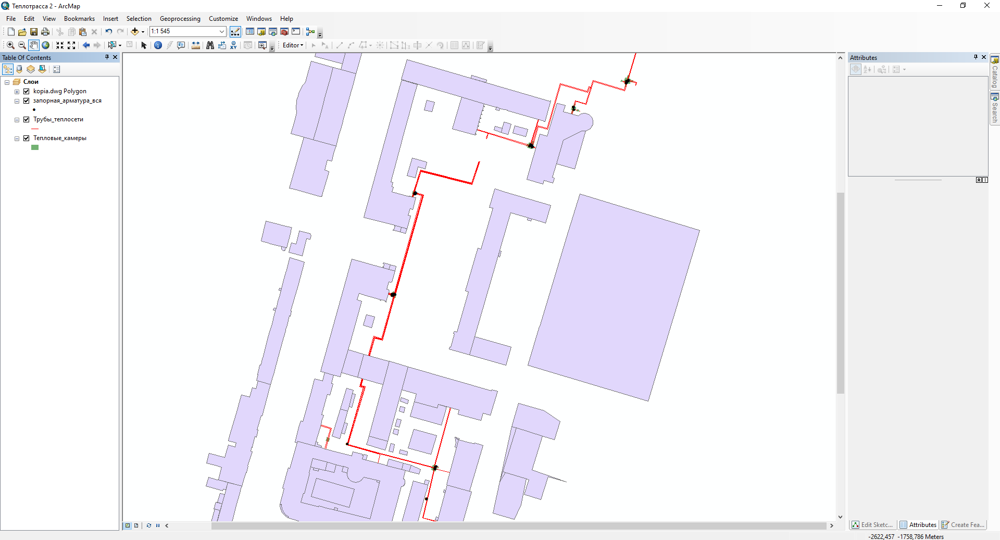
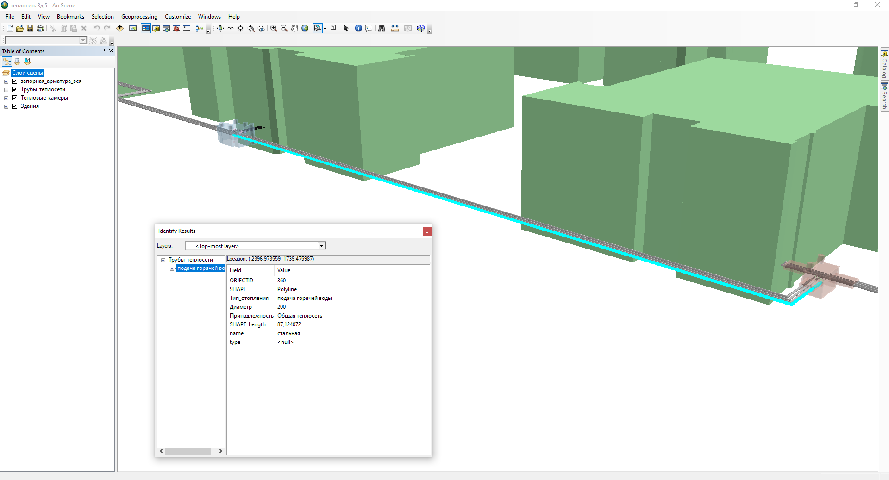
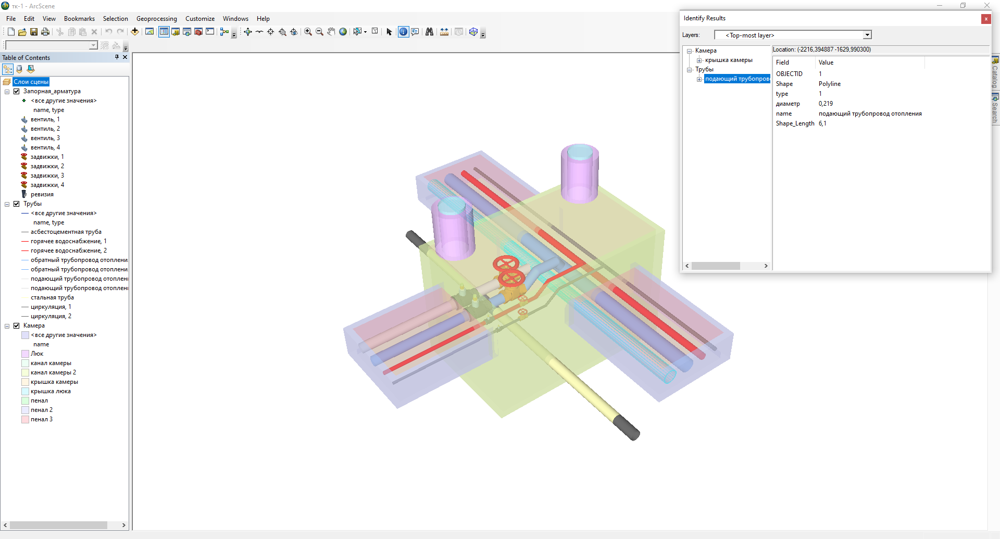

# engineering-communications
# Разработка информационной поддержки на основе ГИС–технологий процесса обслуживания инженерных коммуникаций в составе экосистемы «Умный кампус УУНиТ»

Использование геоинформационных технологий и переход к трехмерному представлению тепловых сетей позволяют создать более точные и реалистичные цифровые двойники инженерных коммуникаций. Это предоставляет возможность более эффективно планировать, разрабатывать и мониторить системы теплоснабжения, а также улучшить визуальное представление инженерных сетей. Эти инновации существенно способствуют оптимизации управления ресурсами и повышению общей эффективности работы инженерных коммуникаций, что важно для современных учебных заведений.

Рисунок 1 – Тепловая сеть

Рисунок 2 – Тепловая сеть трехмерное представление

Рисунок 3 – Теплокамера 1 трехмерное представление
